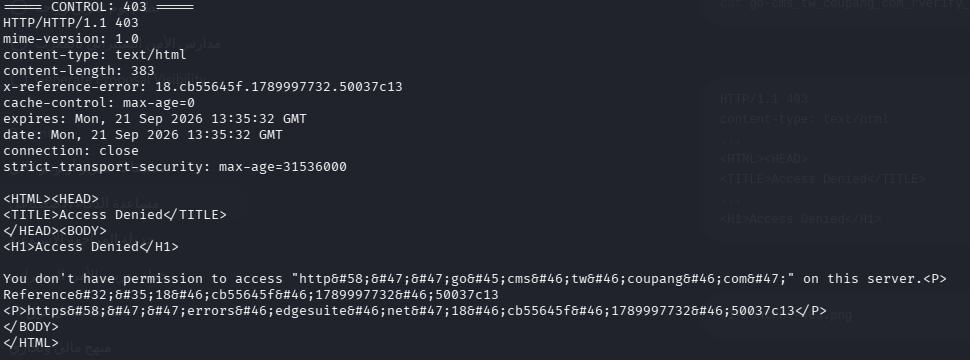
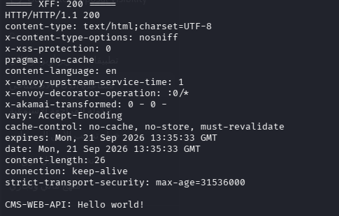
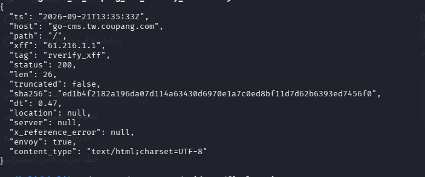

# X-Forwarded-For Origin Access-Control Bypass

## Summary

During authorized security testing of `go-cms.tw.coupang.com`, I identified an access-control behavior where a client-controlled `X-Forwarded-For` header influenced whether the request could reach the origin application.

A baseline request returned `403 Access Denied`. When the same endpoint was tested with the observed `X-Forwarded-For` value, the response changed to `200 OK` and returned an origin application response.

---

## Target

```text
go-cms.tw.coupang.com
```

## Vulnerability Type

**Client-Controlled `X-Forwarded-For` Trust / Access-Control Bypass**

---

## Technical Overview

`X-Forwarded-For` is commonly used by reverse proxies, load balancers, and other intermediary infrastructure to communicate the original client IP to backend systems.

During testing, the observed access-control behavior indicated that a client-supplied `X-Forwarded-For` value could influence the access-control decision.

This created a difference between the baseline request and the request containing the tested forwarded IP value.

---

# Methodology

## 1. Baseline Request

A normal request was sent to the target without an `X-Forwarded-For` header.

The request was denied by the observed perimeter access-control layer.

### Result

```http
HTTP/1.1 403 Forbidden
```



The `403` response establishes the baseline behavior used for comparison.

---

## 2. `X-Forwarded-For` Test

The same endpoint was then tested with the following header:

```http
X-Forwarded-For: 61.216.1.1
```

The response changed from the baseline behavior to:

```http
HTTP/1.1 200 OK
```

The response also returned:

```text
CMS-WEB-API: Hello world!
```



This demonstrated that the supplied forwarded IP value influenced the observed access-control behavior and resulted in an origin application response.

---

## 3. Request Metadata

The test metadata records the relevant request information, including the target host, request path, tested `X-Forwarded-For` value, and resulting HTTP status.



---

# Request Flow

## Baseline Request

```text
Client
  |
  | GET /
  |
  v
Perimeter / Edge
  |
  | Access denied
  v
403 Forbidden
```

## Request with `X-Forwarded-For`

```text
Client
  |
  | GET /
  | X-Forwarded-For: 61.216.1.1
  |
  v
Perimeter / Edge
  |
  | Request accepted
  v
Origin Application
  |
  v
200 OK
```

---

# Evidence

The finding is supported by three pieces of evidence:

### Evidence 1 — Baseline

The baseline request returned:

```text
403 Forbidden
```

Screenshot:

`01-control-403.png`

### Evidence 2 — Modified Request

The request containing the tested `X-Forwarded-For` value returned:

```text
200 OK
```

and exposed:

```text
CMS-WEB-API: Hello world!
```

Screenshot:

`02-xff-200-origin.png`

### Evidence 3 — Metadata

The recorded metadata confirms the tested host, request path, forwarded IP value, and response status.

Screenshot:

`03-xff-metadata.png`

---

# Impact

The finding demonstrates that a client-controlled forwarded IP value could influence the observed perimeter access-control decision.

The practical impact demonstrated during testing was **unauthorized origin reachability** through the observed access-control restriction.

The testing did not demonstrate:

* Authentication bypass
* Account takeover
* Access to customer data
* Credential disclosure
* Token disclosure
* Administrative functionality
* Data modification
* Remote Code Execution

Therefore, the documented impact is limited to the access-control and origin-reachability behavior that was actually demonstrated.

---

# Root Cause

The observed behavior is consistent with an access-control mechanism trusting a client-influenced `X-Forwarded-For` value when determining whether a request should be allowed.

`X-Forwarded-For` itself is a legitimate HTTP mechanism commonly used in proxy-based architectures.

The security issue arises when a security-sensitive access-control decision relies on a value that can be directly influenced by an untrusted requester.

---

# Remediation

The infrastructure should ensure that forwarded client IP information used for security-sensitive access-control decisions can only originate from trusted proxy infrastructure.

Recommended controls include:

1. Strip or overwrite client-supplied forwarding headers at the trusted proxy boundary.
2. Only trust `X-Forwarded-For` values added by explicitly trusted proxies.
3. Ensure origin access-control rules use a trustworthy source of client identity.
4. Prevent direct or unintended origin exposure where possible.
5. Re-test the access-control behavior after remediation.

---

# Security Testing Notes

Testing was limited to a
